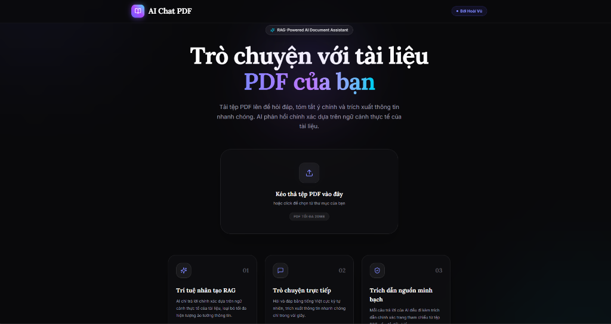

# ChatPDF Pro

Ứng dụng hỗ trợ phân tích và tương tác trực tiếp với tài liệu PDF sử dụng kiến trúc RAG (Retrieval-Augmented Generation). Hệ thống được thiết kế tối ưu hiệu năng thông qua việc tính toán vector embedding cục bộ (local embeddings) và lưu trữ ngữ cảnh thông minh để giảm thiểu chi phí API LLM.



---

## 🛠️ Công nghệ & Kiến trúc hệ thống

Dự án được xây dựng theo mô hình Monorepo chia làm hai phần chính độc lập:

### 1. Frontend (`/frontend`)
*   **Framework:** Next.js 16 (App Router)
*   **Giao diện:** Tailwind CSS v4 kết hợp Framer Motion giúp tạo hiệu ứng mượt mà.
*   **Deployment:** Cấu hình tĩnh (Static HTML Export) chạy trên hạ tầng CDN của Vercel giúp giảm thời gian phản hồi (Cold Start 0ms).

### 2. Backend (`/backend`)
*   **API Engine:** FastAPI (Python)
*   **Xử lý văn bản:** PyMuPDF (fitz) giúp phân tách và đọc tệp PDF tốc độ cao.
*   **Vector Database:** ChromaDB lưu trữ các đoạn văn bản phục vụ truy xuất ngữ cảnh.
*   **Embeddings Model:** Sử dụng mô hình chạy offline `ONNXMiniLM_L6_V2` nhằm tối ưu chi phí dịch vụ bên thứ ba và giảm thiểu độ trễ mạng khi số hóa tài liệu.
*   **Mô hình ngôn ngữ lớn (LLM):** Sử dụng `gemini-2.5-flash` để tổng hợp câu trả lời dựa trên tài liệu được cung cấp.
*   **Deployment:** Container hóa qua Dockerfile và triển khai trên Hugging Face Spaces.

---

## 🚀 Hướng dẫn cài đặt dưới local (Local Development)

### 1. Cấu hình Backend
```bash
cd backend
python -m venv venv

# Kích hoạt môi trường ảo
source venv/bin/activate  # macOS/Linux
venv\Scripts\activate    # Windows

pip install -r requirements.txt
```

Tạo file `.env` trong thư mục `/backend`:
```env
GEMINI_API_KEY=your_gemini_api_key_here
GEMINI_MODEL=gemini-2.5-flash
FRONTEND_URL=http://localhost:3000
```

Chạy server cục bộ:
```bash
uvicorn app.main:app --reload --port 8000
```

### 2. Cấu hình Frontend
```bash
cd frontend
npm install
```

Tạo file `.env.local` trong thư mục `/frontend`:
```env
NEXT_PUBLIC_API_URL=http://localhost:8000
```

Chạy dev server:
```bash
npm run dev
```

---

## 📦 Triển khai sản phẩm (Production Deployment)

*   **API Service:** Được đóng gói tự động bằng Docker và chạy trực tiếp trên Hugging Face Space.
*   **Web Client:** Cấu hình build tĩnh (`output: "export"`) và trỏ thư mục đích thông qua file `vercel.json` ở root để Vercel tự động nhận diện và cập nhật từ nhánh `main`.

